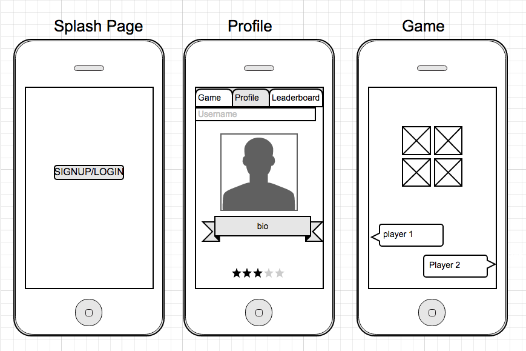

# Ion-tic
Tic-tac-toe goes mobile with ionic/cordova

## Get Started:

## Requirements:

* Implement basic logic: turn-based logic, win calculation, no playing a square that is already occupied, etc.
* Assume 2 human players (no AI)
* Build a 3x3 board size for the UI; win logic should support an NxN board size

### Methodology:

* Mobile-first
* Lean UX Design Process
* Test

#### Lean UX Design
Assumptions:
Business Assumptions
* Customers have a need to compete and interact with each other

* These needs can be solved with a mobile mini-game

* My initial customer will be public transit commuters with smartphones

* No 1 value my customer wants to get out of my service is entertainment

* Additional benefits to customer is a sense of community, acceptance and interaction with others

User Assumptions
* The user are millenials with smartphones(android devices) who use public transit to commute

* This product fits in between their 'living space' and 'work space'

* The product is used when users commute from place to place or while they are waiting to use public transit

* Important features: quick login, custom profile(avatar), player matchup, save gaming record on a public leaderboard

* Product should borrow the color-scheme of a connect-four game and behave like a traditional tic-tac-toe game

Hypothesis: Millenials want to play 1v1 games on their smartphone without a lengthy sign-up process.

Outcomes:
* k-factor
* Daily-active-users (DAU)
* Retention
* New Users
* Average session length
* Average session/user

Personas:

Timothy {
  gender: male,
  age: 24,
  relationship: single,
  likes: { bbq, ufc, metal, cars/trucks },
  lives: east-austin,
  pain-points: { busy with work, no time to meet people IRL, gets bored easily },
  solution: { be entertained during commute, join online community, meet people online }
}

Features:
We will create a quick sign-up/in process with facebook for on-the-go users in order to achieve new user signups
We will create custom profile avatar for users in order to extend the average session length
We will create share incentives in order to raise k-factor and attract new users

Low-res Wireframe:

#### Dev Process
* 5/12 - Design
* 5/13 - Create blank ionic skeleton, add android platform
* 5/14 - Create tab templates + controllers & services
* 5/15 - Finish tab layout

## Contact:

* Email: projects@marcopineda.com

* Twitter: [@marcoapineda13](http://twitter.com/marcopineda)
